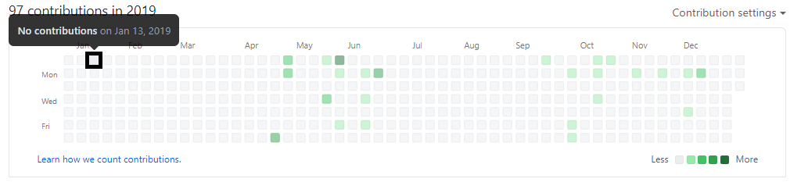
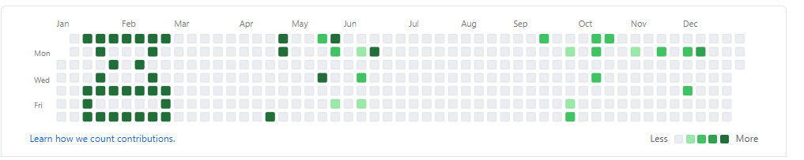

# timelineDrawer
The program which will allow you to draw in Github commit history calendar🎨📆👾


## Getting Started
 1. Fork this repository.
 2. Clone forked repository
 3. Change the line in drawer.py with the forked repository HTTPS for example: 
  ```
git remote add origin <https://github.com/"username"/"repository".git>
```
 4. Run the program
##### 
```
$ python drawer.py
```
 5. Draw the figure which you want to represent in the timeline
 6. Input the day, month and year from where you want to start drawing
 7. Press "Start drawing" button


## Results 
#### Before drawing in the timeline:


#### Using Timeline drawer:


#### After drawing in the timeline:



## License
[MIT License](https://choosealicense.com/licenses/mit/)
